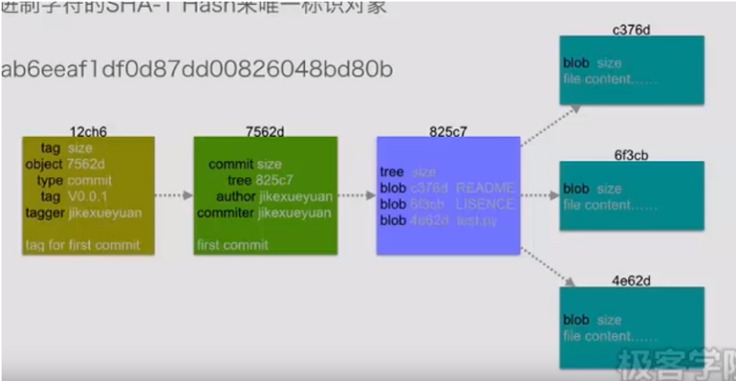

# Git基本操作

> **本文档中（）中的内容都是可要可不要的**

## Git的四种文件

- blob ： 文本文件、 二进制文件

- tree：目录

- commit：历史提交

- tag：指向固定历史提交

  


## Git的基本工作流程


## Git下载别人的github代码

本地文件夹（用于映射云端文件，自己任意新建或选择一个）空白处右击选择`Git Bash Here`，输入以下代码：

```git
git init (+ repName) 会创建一个.git目录
---
git clone [URL]/ （自定义名称）   获取一个远程裸仓库的地址(也可以是本地)

```


## git 版本控制的配置

- 注册github账号，记下注册邮箱与用户名

- 在本地文件夹（用于映射云端文件）空白处右击选择`Git Bash Here`

  

- 输入以下代码

  ```git
  git config --global user.name "自己注册时候的用户名"
  git config --global user.email 自己注册时候的邮箱
  
  git remote add origin 自己云端仓库的URL
  ```

- 之后进行以下流程：

  ```git
  //初试化仓库
  git init (+repName)
  
  //进入仓库
  cd repName (或者.git)
  
  //跟踪并添加文件到暂存区
  touch a (a、b都是文件名)
  touch b
  git add a b
  
  //获取暂存区信息
  git status 
  "提示信息"
  
  //提交
  git commit -m "提交信息"
  
  //修改a
  vim a (修改a)
  *****
  
  //获取暂存区信息
  git status
  "提示信息"
  
  //添加到暂存区a并提交
  git add a
  git commit -m "modify a"
  
  //删除
  git rm a
  ls
  git status
  
  
  //只删除暂存区的a
  git rm --cached a
  
  //提交
  git add a
  git commit -m "xxxx"
  
  //重命名
  git mv a c
  git status
  git add a c
  git status
  
  // 添加全部
  git add . 
  git add -A
  
  //剔除不需要添加的(以'*'开头则是不需要的)
  vim .gitignore
  *.[oa]
  *~
  *.pyc
  !test.pyc//纳入此文件，以'!'开头文件则\!test.pyc
  foo/
  **/res
  build/
  Documentation/
  src/
  .DS_Store  
  
  git status
  
  ```


## git 添加全部文件到云端

```git
git add .
git commit -m "info"
git push

```

## git 添加特定文件到云端

``` git
touch a
git add a
git commit -m "info"
git push
```

## git 云端的修改同步到本地

```git
git pull
```

