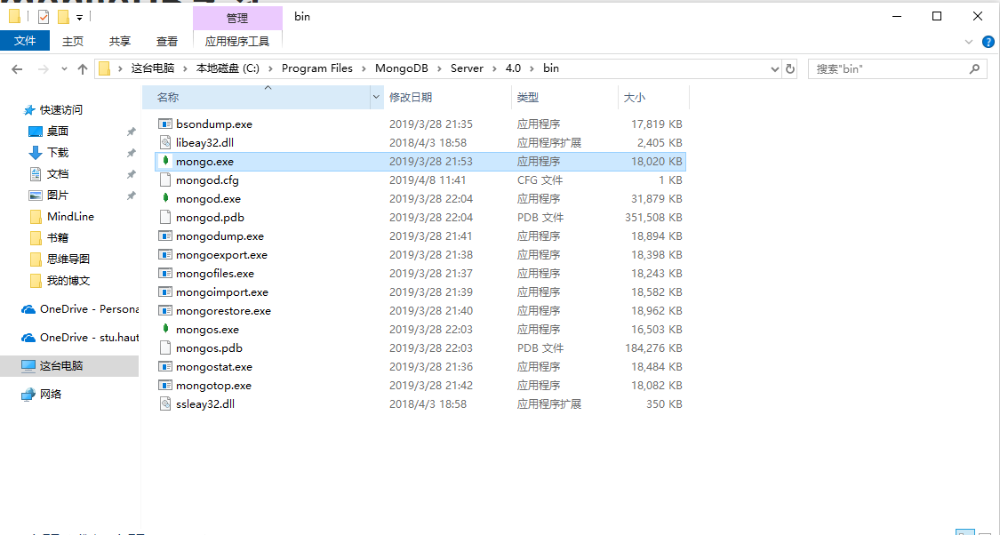
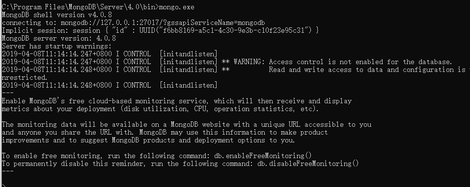

# mongoDB通过chocolatey的安装与配置

## 1 安装与配置（windows下）

### 1.1 借助chocolatey安装MongoDB

- 安装chocolatey（chocolatey是一个软件管理器，运行在windows客户端下，一般通过命令行安装与管理软件，对于程序员拉说，环境可以自动配置好，省却了windows开发人员的环境配置难题）
- 官网安装方式：<https://chocolatey.org/install>（通过cmd或powershell输入官网给出的命令）
- 安装之后直接输入：`choco install mongodb`
- 等待安装完成

### 1.2 安装完成后找到安装目录运行`mongo.exe`

- windows下的安装目录为`C:\Program Files\MongoDB\Server\4.0\bin`

- 在上述目录下，需要看到如下图所示的这些文件：

  

- 在上方的地址栏中输入`cmd.exe`打开本路径下的资源管理器，并输入`mongo.exe` ，如果配置正确，则会出现如下的情景：

  

> 此时，已经建立了与数据库的连接，至于具体的操作，可以参考**菜鸟教程**从创建数据库开始之后的内容<http://www.runoob.com/mongodb/mongodb-tutorial.html>

### note： 菜鸟教程上所需要的配置已经不需要，chocolatey会自动创建data和log目录：

- data:`C:\ProgramData\MongoDB\data`

- log：`C:\ProgramData\MongoDB\log`