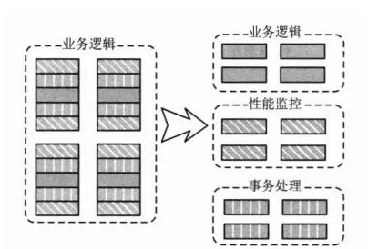

# 信息工程大学复试常问的问题

- 本科期间做过什么课题、完成了其中的哪部分工作

- 参加过什么竞赛

- 毕设题目是什么

- 主要研究什么

- 准备用什么方法解决

## 毕设技术：spring boot 

###  1.1	 java EE 后端开发的事实标准：spring

目前spring已经成为了事实上的后端开发标准，得益于它提出的两大概念：
控制反转和面向切面编程

### 1.1.1	控制反转（IOC）
- 依赖注入；（不是在对象内交给自己去实现控制，而是交给容器去控制）

- 业务逻辑层和DAO层

  **DAO层**

  专门用来封装我们对于实体类的数据库的访问，就是增删改查。

  **业务逻辑层**

  就是负责和前台信息交互并且处理前台请求

- 降低代码的耦合度、依赖度；

- 高复用，低耦合；

  

  举例来说，假如我们开发网站的时候用了Spring，和适当的数据库框架，将spring的环境配置好了之后，先创建实体类用于和数据库之间的映射。当实现映射之后，如果使用传统的方法，我们需要使用java SE的库去写冗长的代码实现java代码和数据库之间的沟通。而spring根据它提出的概念，在配置文件完善的情况下，在DAO层的代码中在某一个特定的类中加入一个`@AutoWired`，这个时候在引用这个注解下的方法就可以活得已经和数据库实现映射的实体类，也就是说可以获得数据库的数据了。由此实现了依赖注入，对数据库的控制从原来的对象控制交给spring这个容器去控制了。对业务逻辑层的类似，没有spring的时候，要实现前后台传值需要利用很多HTTP库的细节自己处理，还容易出错，现在只要前台的form表单中的值在后台被注解的类中可以通过特定函数直接获得。这里的注解一般是`@RequestMapping`匹配前台action，在被注解的方法的变量中的变量前加入`@paramater`就可以获得前台的值。就省略了与业务无关的HTTP传值。 这就是控制反转！！说白了就是让程序员更专注于逻辑而非这种偏向底层的东西。分层的思想。拿网络的分层思想做比，可能我本来是传输层对我是不透明的，我需要考虑很多东西，现在传输层透明了，我只需要专心写我的应用层代码就行了。需要用到下面的功能的时候，我就调用给定的接口就ok。

### 1.1.2	面向切面编程（AOP）

#### AOP是OOP的一种继承和发展

举个例子，假如一个用户需要登录，如果你使用的是OOP，那么只能在Controller里对用户进行一个个的鉴别。就是说需要破坏你的纯业务结构，代码会有重复。而面向切片的编程做到：**剖解开封装的对象内部，并将那些影响了多个类的公共行为封装到一个可重用模块**

业务逻辑的变换如下：

而如果用面向切片编程的思想的话

 