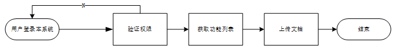
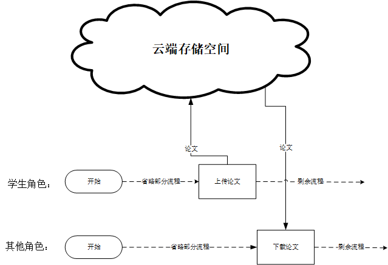
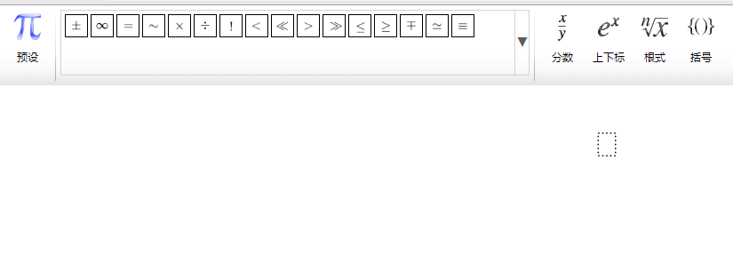
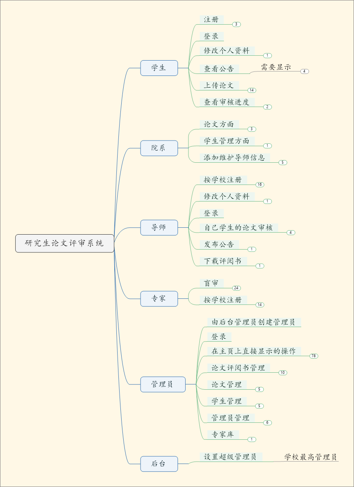

# 1 研究目标
## 1.1 利用信息系统上传论文
&ensp;&ensp;
此系统的设定应用场景是研究生学位论文评审期间。所以学位论文的上传是必须的功能。此系统计划的用户操作流程如下：
&ensp;&ensp;

&ensp;&ensp;
在以下的各个功能描述中，笔者将以基本流程图的形式展现。在对功能进一步挖掘时，将在各个基本流程图的基础生进行扩充。  
&ensp;&ensp;
由上图可见，基本流程中，欲实现本功能，需以权限验证，获取功能列表等其他功能为前提。 同时，每一步的基本流程的成功的内部原理将在之后的篇幅展现。 
&ensp;&ensp;
## 1.2 利用信息系统存储与传输论文
&ensp;&ensp;
存储论文是将学生上传的论文文件存储到云端数据库。具体原理原将在之后的篇幅中展现。现给出基本流程描述以及示意图。  
&ensp;&ensp;
学生登录本系统、验证权限、选择上传论文后，由系统弹出文件选择器，由学生选择文件。之后系统将文件发送到云端服务器，由云端服务器分配存储空间并重命名文件以固定匹配学生。示意图如下：
&ensp;&ensp;

&ensp;&ensp;
## 1.3 利用信息系统隐藏作者信息
&ensp;&ensp;
对论文进行内容操作则需要在云端存储空间内进行。  
&ensp;&ensp;
如果对过程进行简要描述，则学生登录本系统、验证权限、选择上传论文后，由系统弹出文件选择器，由学生选择文件。之后系统将文件发送到云端服务器。同时由云端服务器分配存储空间复制文件，对复制的这一批文件重命名以固定匹配学生，再由系统利用第itext三方框架，对文件进行批量删除文章第一、二页（本系统给定模板，论文第一页内容为个人信息，第二页为包含个人，导师信息的其他内容）。专家下载时，则分配已经修改后的文档。
&ensp;&ensp;
## 1.4 利用信息系统撰写评阅意见与评阅成绩
&ensp;&ensp;
笔者参考了之前的类似的信息系统，共性问题之一便是专家撰写评语时无法插入公式。这对于论文评审的结果的信服力极其不利。尤其是理工类大学，此项功能则是刚需。  
&ensp;&ensp;
本系统计划采用第三方框架提供多样化的文本编辑框用来让专家输入评语。此功能计划基于SVG，利用由github作者fex-team编写的开源项目kityformula-editor中的代码重构到本系统中。  
&ensp;&ensp;
计划效果图如下：  

## 1.5 利用信息系统管理不同角色用户
&ensp;&ensp;
本系统的应用场景决定了必须的多个用户角色。包含学生、导师、专家、管理员、院系以及后台。 其中除了后台管理员外的其他人必须有基本的注册登录以及信息录入功能。各具特色的功能则有学生可以上传论文、查看公告以及查看评阅结果。导师拥有学生角色的全部功能，此外，对学生的论文有权驳回。专家角色的功能比较单一，只有根据提取码提取出论文和撰写评语。当然，必要的信息录入是必须的。管理员拥有除了评审论文以为的系统所有功能，包括学生与专家的全部功能，还可以创建与管理批次，批量管理论文信息，批量发送论文以审阅等各种权限极高的功能。后台管理员只有创建管理员的功能，单一但是关键。  
&ensp;&ensp;
示意图如下：

# 2 研究内容
# 3 拟采取的研究手段（技术、框架）
## 3.1前端
### 3.1.1 Bootstrap4
&ensp;&ensp;
Bootstrap 是全球最受欢迎的前端组件库，用于开发响应式布局、移动设备优先的 WEB 项目。	Bootstrap4 目前是 Bootstrap 的最新版本，是一套用于 HTML、CSS 和 JS 开发的开源工具集。利用提供的 Sass 变量和大量 mixin、响应式栅格系统、可扩展的预制组件、基于 jQuery 的强大的插件系统，能够快速开发出原型或者构建整个 app 。  
### 3.1.2 Jquery
&ensp;&ensp;
jQuery 是一个 JavaScript 库，极大地简化了 JavaScript 编程。是一个轻量级的"写的少，做的多"的JavaScript库。jQuery库包含以下功能：
-	HTML 元素选取
-	HTML 元素操作
-	CSS 操作
-	HTML 事件函数
-	JavaScript 特效和动画
-	HTML DOM 遍历和修改
-	AJAX
-	Utilities
&ensp;&ensp;
除此之外，Jquery还提供了大量的插件。
### 3.1.3 Thymeleaf
&ensp;&ensp;
Thymeleaf 是面向 Web 和独立环境的现代服务器端 Java 模板引擎，能够处理 HTML、XML、JavaScript、CSS 甚至纯文本。
Thymeleaf 的主要目标是提供一个优雅和高度可维护的创建模板的方式。 为了实现这一点，它建立在自然模板（ Natural Templates）的概念上，将其逻辑注入到模板文件中，不会影响模板被用作设计原型。 这改善了设计的沟通，弥合了设计和开发团队之间的差距。
Thymeleaf 的设计从一开始就遵从 Web 标准，特别是 HTML5，这样就能创建完全符合验证的模板
			
## 3.2前端与服务器交互
### 3.2.1 Ajax
&ensp;&ensp;
AJAX = 异步 JavaScript 和 XML。AJAX 是一种用于创建快速动态网页的技术。通过在后台与服务器进行少量数据交换，AJAX 可以使网页实现异步更新。这意味着可以在不重新加载整个网页的情况下，对网页的某部分进行更新。传统的网页（不使用 AJAX）如果需要更新内容，必需重载整个网页面。有很多使用 AJAX 的应用程序案例：新浪微博、Google 地图、开心网等等。
## 3.3服务器
### 3.3.1 JavaEE
#### Java语言是简单的：
&ensp;&ensp;
Java语言的语法与C语言和C++语言很接近，使得大多数程序员很容易学习和使用。另一方面，Java丢弃了C++中很少使用的、很难理解的、令人迷惑的那些特性，如操作符重载、多继承、自动的强制类型转换。特别地，Java语言不使用指针，而是引用。并提供了自动的废料收集，使得程序员不必为内存管理而担忧。  
#### Java语言是面向对象的：
&ensp;&ensp;
Java语言提供类、接口和继承等面向对象的特性，为了简单起见，只支持类之间的单继承，但支持接口之间的多继承，并支持类与接口之间的实现机制（关键字为implements）。Java语言全面支持动态绑定，而C++语言只对虚函数使用动态绑定。总之，Java语言是一个纯的面向对象程序设计语言。  
#### Java语言是分布式的：
&ensp;&ensp;
Java语言支持Internet应用的开发，在基本的Java应用编程接口中有一个网络应用编程接口（java net），它提供了用于网络应用编程的类库，包括URL、URLConnection、Socket、ServerSocket等。Java的RMI（远程方法激活）机制也是开发分布式应用的重要手段。
### 3.3.2 SpringBoot
&ensp;&ensp;
Spring框架功能很强大，但是就算是一个很简单的项目，我们也要配置很多东西。因此就有了Spring Boot框架，它的作用很简单，就是帮我们自动配置。Spring Boot框架的核心就是自动配置，只要存在相应的jar包，Spring就帮我们自动配置。如果默认配置不能满足需求，我们还可以替换掉自动配置类，使用我们自己的配置。另外，Spring Boot还集成了嵌入式的Web服务器，系统监控等很多有用的功，让我们快速构建企业及应用程序。
			
## 3.4代码与包托管
### 3.4.1 Maven
&ensp;&ensp;
Maven 翻译为"专家"、"内行"，是 Apache 下的一个纯 Java 开发的开源项目。基于项目对象模型（缩写：POM）概念，Maven利用一个中央信息片断能管理一个项目的构建、报告和文档等步骤。Maven 是一个项目管理工具，可以对 Java 项目进行构建、依赖管理。Maven 也可被用于构建和管理各种项目，例如 C#，Ruby，Scala 和其他语言编写的项目。Maven 曾是 Jakarta 项目的子项目，现为由 Apache 软件基金会主持的独立 Apache 项目。
### 3.4.2 GitHub
&ensp;&ensp;
GitHub 是一个面向开源及私有软件项目的托管平台，因为只支持 Git 作为唯一的版本库格式进行托管，故名 GitHub。
GitHub 于 2008 年 4 月 10 日正式上线，除了 Git 代码仓库托管及基本的 Web 管理界面以外，还提供了订阅、讨论组、文本渲染、在线文件编辑器、协作图谱（报表）、代码片段分享（Gist）等功能。目前，其托管版本数量非常之多，而且其中不乏知名开源项目，例如 Ruby on Rails、jQuery、python 等。  
&ensp;&ensp;
作为开源代码库以及版本控制系统，Github 拥有超过千万的开发者用户。随着越来越多的应用程序转移到了云上，Github 已经成为了管理软件开发以及发现已有代码的首选方法。

