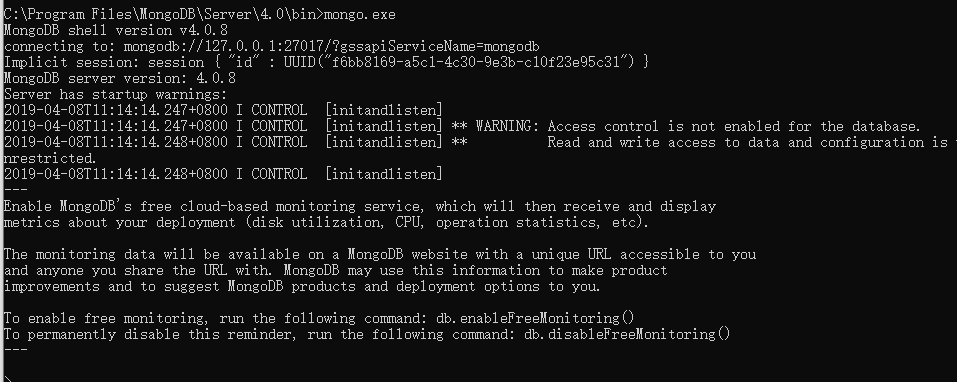

# mongoDB通过chocolatey的安装与配置

## 1 安装与配置（windows下）

### 1.1 借助chocolatey安装MongoDB

- 安装chocolatey（chocolatey是一个软件管理器，运行在windows客户端下，一般通过命令行安装与管理软件，对于程序员拉说，环境可以自动配置好，省却了windows开发人员的环境配置难题）
- 官网安装方式：<https://chocolatey.org/install>（通过cmd或powershell输入官网给出的命令）
- 安装之后直接输入：`choco install mongodb`
- 等待安装完成

### 1.2 安装完成后找到安装目录运行`mongo.exe`

- windows下的安装目录为`C:\Program Files\MongoDB\Server\4.0\bin`

- 在上述目录下，需要看到如下图所示的这些文件：

  

- 在上方的地址栏中输入`cmd.exe`打开本路径下的资源管理器，并输入`mongo.exe` ，如果配置正确，则会出现如下的情景：

  

> 此时，已经建立了与数据库的连接，至于具体的操作，可以参考**菜鸟教程**从创建数据库开始之后的内容<http://www.runoob.com/mongodb/mongodb-tutorial.html>

### note： 菜鸟教程上所需要的配置已经不需要，chocolatey会自动创建data和log目录：

- data:`C:\ProgramData\MongoDB\data`

- log：`C:\ProgramData\MongoDB\log`

## 2、mongoDB与关系型数据库

| mongoDB术语 | 关系数据库术语 | 备注   |
| ----------- | -------------- | ------ |
| database    | database       |        |
| table       | collection     |        |
| row         | document       |        |
| column      | filed          |        |
| index       | index          |        |
| table joins |                | 表连接 |
| primary key | primary key    |        |


## 3、mongoDB客户端之Robot 3T使用

- 安装与连接
- 创建database与collection
- 右击数据库：openshell，之后使用MongoDB的命令

## 4、 必要命令

- 创建数据库的用户

  ```shell
  db.createUser({user:'admin',pwd:'0305',roles:[{role:'dbOwner',db:'paper_review'}]})  
  ```

- 创建indexs

  ```shell
  //>db.collection.createIndex(keys, options)(1位升序，-1为降序)
  
  db.students.createIndexes([{student_id:1},{password:1},{mentor:1},{name:1},{phone_number:1},{person_id:1}])
  ```

  

## 5、Spring-boot 配合mongoDB环境搭建

- 添加MongoDB配置（在application.properties中）

  ```
  #mongoDB的配置
  spring.data.mongodb.host=localhost
  spring.data.mongodb.username=admin
  spring.data.mongodb.password=0305
  spring.data.mongodb.port=27017
  spring.data.mongodb.database=paper_review
  ```

  

  